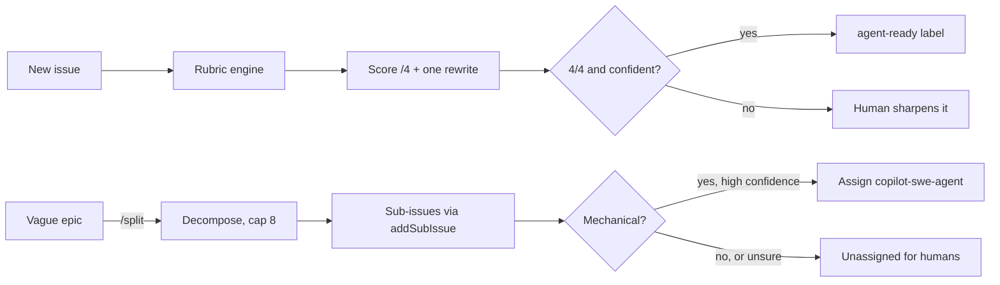

# Dispatch

**A project board as a dispatcher between human and machine work, rather than a list.**

Two things, sharing one engine:

1. **Agent-readiness linter** — scores every new issue out of 4 and leaves *one* concrete suggestion. Never blocks. Says "I can't judge this" instead of inventing a number.
2. **`/split`** — decomposes an epic into real GitHub sub-issues, works out which are mechanical, and hands only those to the Copilot coding agent.

Built for the Microsoft Hackathon 2026 challenge *Collaboration using GitHub Planning & Tracking Tools in the Agentic Age*. Adapted from organizer ideas [#3](https://github.com/reneexeener/msft-hackathon-2026/issues/3) and [#4](https://github.com/reneexeener/msft-hackathon-2026/issues/4).

---

## The idea in one paragraph

Both features need the same primitive: **a judgement about whether a piece of work is agent-actionable.** The linter exposes it as a score. `/split` uses it as a routing decision. So `mechanical` isn't a separate question — it's a high readiness score plus a check that the resulting diff could be reviewed without an opinion. Build the rubric once, and the splitter is decomposition plus a threshold.



---

## Three decisions that shaped this

**The model judges; deterministic code supplies the facts.** Every path an issue mentions is extracted and checked against the real git tree, pinned to a commit sha. The model is told the result rather than asked to guess. This catches something text analysis cannot: an issue naming `src/legacy/adapter-v1.js` when that file no longer exists. It reads like a perfect ticket, and an agent handed it will flail and open a garbage PR. Worse than a vague issue, invisible without the check.

**Booleans, not a number.** The model returns four pass/fail signals with evidence; the score is `count(passes)` computed in code. Ask a model for "a score out of 4" and it will hand you a plausible 3 without committing to which signal failed.

**The routing asymmetry is the safety property.** A wrongly-human item costs someone ten minutes. A wrongly-agent item costs a confident pull request embodying a decision nobody made. So `mechanical` requires *all* of: outcome fully determined, diff verifiable without opinion, no taste required, classifier confident, and every named path verified. Any doubt collapses to `judgement`. There's a test asserting no single failing condition can be outvoted by the others.

---

## Setup

### 1. Install

```bash
npm install
cp .env.example .env
```

### 2. Find your Azure deployment names

Deployment names are chosen per Azure resource and rarely match model names, so guessing wastes time:

```bash
npm run smoke
```

This lists what your key can reach and confirms strict `json_schema` works on each configured deployment. Fill in `.env` from its output.

| Variable | Purpose |
| --- | --- |
| `MODEL_SCORE` | Readiness scoring. Runs on every issue, so a mini model is right. |
| `MODEL_DECOMPOSE` | Epic decomposition. Runs rarely, quality is visible. |
| `MODEL_CLASSIFY` | Mechanical vs judgement. The one genuinely risky call — worth a reasoning model. |

### 3. Score an issue locally

Dry run is the default. Nothing is written without `--post`:

```bash
npm run lint -- --repo owner/name --issue 42
npm run lint -- --repo owner/name --issue 42 --post
npm run lint -- --repo owner/name --all --limit 20
```

The Actions workflow is a thin wrapper over this exact code path — iterating on prompts through push-cycles is miserable.

### 4. Split an epic

```bash
npm run split -- --repo owner/name --issue 12
npm run split -- --repo owner/name --issue 12 --post
npm run split -- --repo owner/name --reclassify 15=judgement --post
```

### 5. Install the bots into a repo

```bash
gh secret   set AZURE_OPENAI_ENDPOINT --repo owner/playground
gh secret   set AZURE_OPENAI_API_KEY  --repo owner/playground
gh variable set DISPATCH_ENGINE_REPO  --repo owner/playground --body diersmann/MSFT-2026-Hackathon
gh variable set MODEL_SCORE           --repo owner/playground --body <your-deployment>

./scripts/install-workflow.sh owner/playground
```

The workflows check out the engine from `DISPATCH_ENGINE_REPO` rather than vendoring a copy, so the rubric has one source of truth.

`/split` needs a PAT in `DISPATCH_PAT` — the default `GITHUB_TOKEN` can't always perform the sub-issue and agent-assignment mutations.

### 6. Demo playground

```bash
npx tsx scripts/seed-demo-repo.ts --repo owner/playground --create
```

Pushes a small real codebase and seeds ten issues calibrated across the score range — including one that reads perfectly but names a file that doesn't exist.

### 7. Dashboard

```bash
GITHUB_TOKEN=$(gh auth token) \
DISPATCH_TARGET_REPO=owner/playground \
npm run dev --workspace @dispatch/dashboard
```

Deploy to Vercel from repo root (`vercel.json` is configured), or deploy the
server-rendered app to Azure App Service with the included GitHub Actions
workflow. See [the Azure App Service deployment guide](docs/azure-app-service.md)
for the required OIDC, repository, and runtime settings.

---

## Measuring the rubric

A linter nobody checks is just opinions with a progress bar.

```bash
npm test          # 89 unit tests, no Azure needed
npm run eval      # rubric vs 16 hand-labeled fixtures
npm run backfill -- --repo owner/name --limit 50
```

`npm run eval` reports **per-signal** agreement separately from exact-score agreement, because the interesting failure is usually one signal disagreeing consistently — that means the rubric wording is off, not the model.

`npm run backfill` prints the score distribution and correlates score against time-to-close. **If 4/4 issues don't close faster, the rubric is wrong**, and the script says so rather than hiding a null result. That's a more interesting finding than a tool that appears to work.

Two honesty guards worth knowing about:

- The distribution warns if every scored issue landed on the same number — a rubric that can't discriminate isn't measuring anything.
- Idea-style issues are reported separately from work items. The organizer repo is mostly ideas, which have no code target, so a backfill there says more about the repo than the rubric.

### Inspect what the model actually sees

```bash
npm run inspect -- --local 3          # a captured organizer issue
npm run inspect -- --fixture stale-path
npm run inspect -- --repo owner/name --issue 42
```

Prints the normalized body, parsed sections and grounding facts without spending a token. Most scoring bugs are normalization bugs.

### Read the output before a contributor does

```bash
npm run preview          # every readiness comment variant
npm run preview:split    # the /split parent summary and a child body
```

Both render from synthetic results, so they cost nothing and work with no credentials. The comment *is* the product surface for the linter — if any variant reads as a wall of feedback rather than one suggestion, the prompt needs tightening.

---

## Layout

```
packages/core/src/
  schema.ts         zod + strict JSON schema for structured outputs
  azure.ts          AzureOpenAI client, per-task model routing
  normalize.ts      strip boilerplate, parse form sections, detect _No response_
  tree.ts           L2 path extraction and verification against the git tree
  rubric.ts         scoreReadiness, scope gate, abstention
  render.ts         the one comment, plus label planning
  split.ts          decompose, classify, addSubIssue, assign Copilot
  split-schema.ts   routeChild — the asymmetric routing decision
packages/cli/src/   lint.ts, split.ts
packages/dashboard/ Next.js dispatcher board
.github/workflows/  readiness-lint.yml, split.yml
fixtures/           hand-labeled work items + captured organizer issues
scripts/            smoke, eval, backfill, seed, inspect
demo-repo/          a deliberately ordinary app to check paths against
```

---

## Design notes

**Why the linter never blocks.** A linter that stops you filing an issue means people stop filing issues. The model step is `continue-on-error`; a model outage is silent rather than a red X on a contributor's issue.

**Why it abstains.** An empty issue can't be scored honestly, and a model asked to score one will still produce four confident FAILs. Abstention is enforced in code, before the model is called, so "honest about itself" is a property rather than a hope.

**Why the comment is one thing.** A wall of feedback gets skimmed, then muted. Score, weakest signal with evidence, one paste-able rewrite. Everything else is behind a `<details>`.

**Why one comment, updated.** A hidden marker means re-runs replace rather than stack. Five bot comments on one issue is how bots get muted.

**Why real sub-issues.** `addSubIssue` gives the parent a progress rollup from GitHub for free, and the relationship survives someone editing the body. A markdown checklist doesn't.

**Why the cap is 8, enforced in code.** Unbounded decomposition produces thirty tickets and despair. A model asked nicely for "at most eight" occasionally returns nine.

**Why 👎 matters.** The footer invites disagreement, and the dashboard counts it. A human overriding the classifier is better evidence than the classifier agreeing with itself.

---

## Known limits

- Scores the description, not the comment thread — deliberately, since that's what a coding agent reads, but it means clarifications buried in comments don't count.
- Path verification can't see through renames; a moved file reads as stale.
- The score-vs-time-to-close correlation needs real throughput to mean anything. On a hackathon repo, `n` is too small and the honest answer is "unknown".
- `copilot-swe-agent` must be available as an assignee in the target repo. Where it isn't, mechanical items are labelled but left unassigned.
